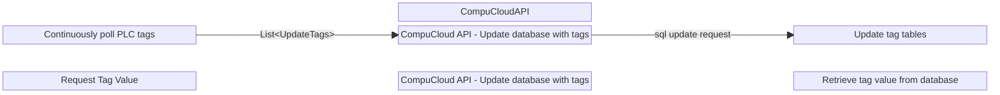

```
block-beta 
    columns 5

space:2 
    CompuCloudAPI
space:2 
    
    TagMonitor["Continuously <br> poll PLC tags"]
space
    CCUpdateDB["CompuCloud API - Update database with tags"]
space
    DB[" Update tag tables"]

space:5 

    RequestTagValue["Request Tag Value"]
space
    CC_GetTag["CompuCloud API - Update database with tags"]
space 
    DBGetTag[" Retrieve tag value from database"]
    
    TagMonitor -- "List&lt;UpdateTags&gt;" --> CCUpdateDB 
    CCUpdateDB -- "sql update request" --> DB 

```


