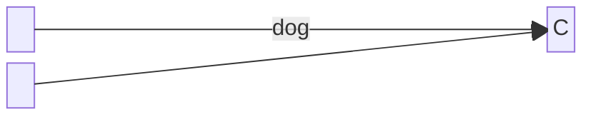

# Mermaid
Mermaid Tutorial

```
block-beta 
    columns 15
    A[" "]
    space:13
    C 

    B[" "]
    space:4

    A -- "dog" --> C 
    B --> C 

```


```mermaid
block-beta 
    columns 15
    A[" "]
    space:13
    C 

    B[" "]
    space:4

    A -- "dog" --> C 
    B --> C
```
